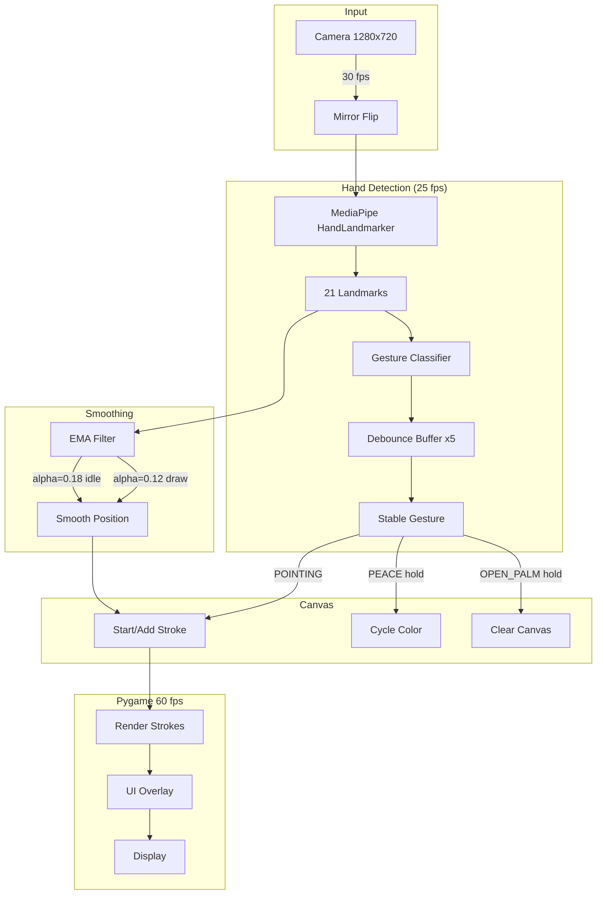

<div align="center">

# AirDraw

[](https://python.org)
[](https://swift.org)
[](https://mediapipe.dev)
[](https://www.apple.com/macos/)
[](LICENSE)

**Draw in the air using hand gestures.** AirDraw tracks your hand in real time and translates finger movements into strokes on a digital canvas. Two implementations: a Python prototype (MediaPipe + Pygame) and a native macOS app (Swift + Vision).

</div>

---

## Features

- **Real-time hand tracking** powered by MediaPipe (Python) and Apple Vision (Swift)
- **5 gesture controls** -- point to draw, pinch to pause, V-sign to cycle color, open palm to clear, fist to pause
- **Exponential moving average smoothing** for fluid, jitter-free strokes (separate coefficients for drawing vs. idle)
- **9-color palette** with adjustable brush width (2--30 px)
- **Undo, clear, and save** -- PNG export to Desktop
- **Camera feed overlay** with hand skeleton and joint visualization
- **Gesture debouncing** -- 5-frame stability buffer prevents accidental triggers

## Architecture



## Gesture Controls

| Gesture | Action | Hold Time |
|---------|--------|-----------|
| Point (index finger) | Draw | Instant |
| Pinch (thumb + index) | Pause (lift brush) | Instant |
| Peace / V-sign | Cycle color | 1.4s hold |
| Open palm | Clear canvas | 1.4s hold |
| Fist | Pause | Instant |

## Tech Stack

| Component | Technology |
|-----------|------------|
| Python version | Python 3, MediaPipe Tasks API, OpenCV, Pygame |
| macOS native | Swift 5.9, SwiftUI, AVFoundation, Apple Vision |
| Hand tracking | MediaPipe HandLandmarker (Python) / Vision framework (Swift) |

## Quick Start

### Python Version

```bash
# Install dependencies
pip install mediapipe opencv-python pygame numpy

# Download the hand tracking model
curl -L https://storage.googleapis.com/mediapipe-models/hand_landmarker/hand_landmarker/float16/latest/hand_landmarker.task \
  -o hand_landmarker.task

# Run
python3 airdraw.py
```

### macOS Native Version (Swift)

Requires macOS 13+ and Swift 5.9+.

```bash
# Build and package as .app
./build.sh

# Run
open AirDraw.app
```

### Keyboard Shortcuts (Python)

| Key | Action |
|-----|--------|
| `Cmd+Z` | Undo last stroke |
| `Cmd+C` | Clear canvas |
| `Cmd+S` | Save drawing as PNG |
| `H` | Toggle camera feed |
| `Arrow Up/Down` | Adjust brush width |
| `Arrow Right` | Next color |
| `Esc` | Quit |

## Camera Permissions

Both versions require camera access:

- **Python:** System Settings > Privacy & Security > Camera > allow Terminal (or your IDE)
- **Swift app:** Requests permission on first launch

## Project Structure

```
airdraw/
├── airdraw.py          # Python app (MediaPipe + Pygame, 694 lines)
├── Sources/AirDraw/
│   ├── AirDrawApp.swift      # SwiftUI app entry point
│   ├── ContentView.swift     # Main view
│   ├── CameraManager.swift   # AVFoundation camera
│   ├── HandTracker.swift     # Apple Vision hand tracking
│   ├── DrawingCanvas.swift   # Canvas rendering
│   └── Models.swift          # Data models
├── Package.swift       # Swift package manifest
├── build.sh            # Build + code-sign script
├── run.sh              # Python convenience launcher
├── Info.plist          # macOS app metadata
└── entitlements.plist  # Camera entitlements
```

## License

MIT
